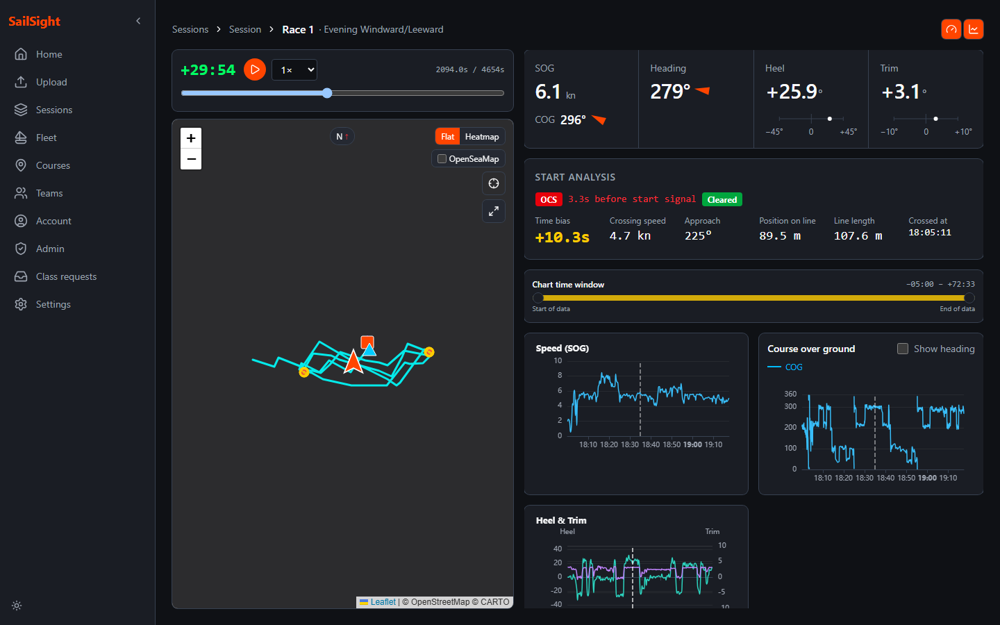
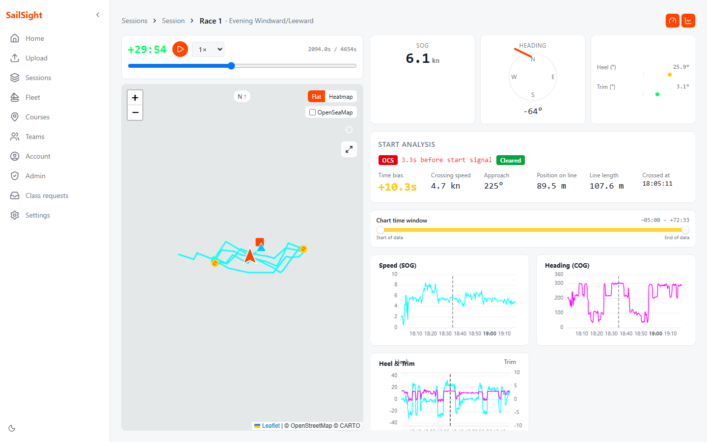
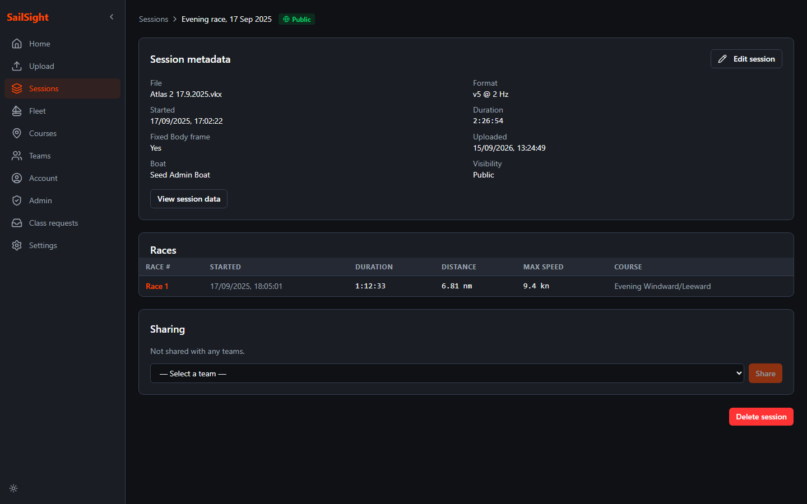
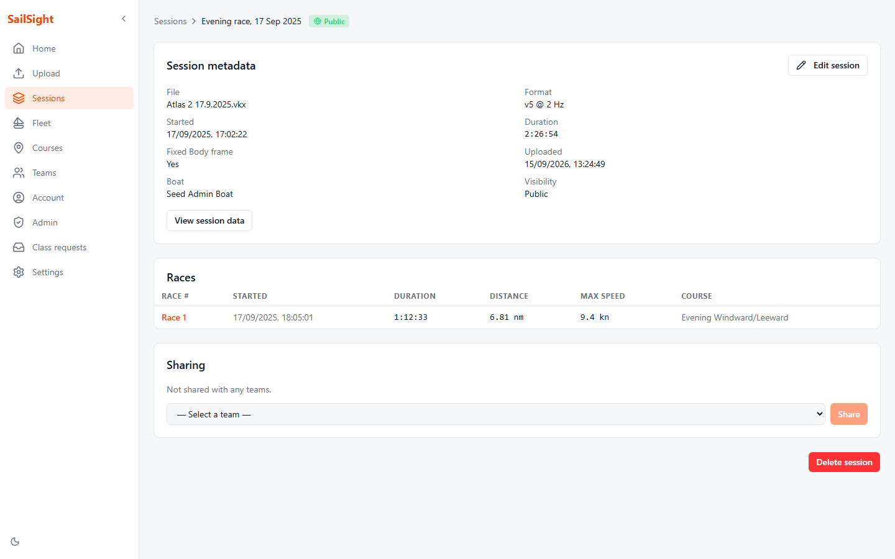
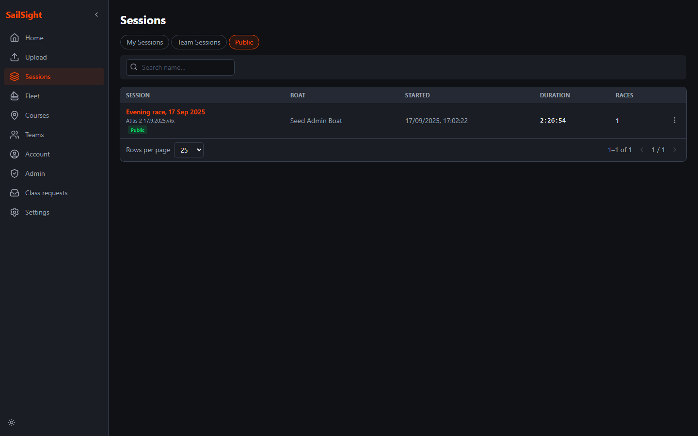
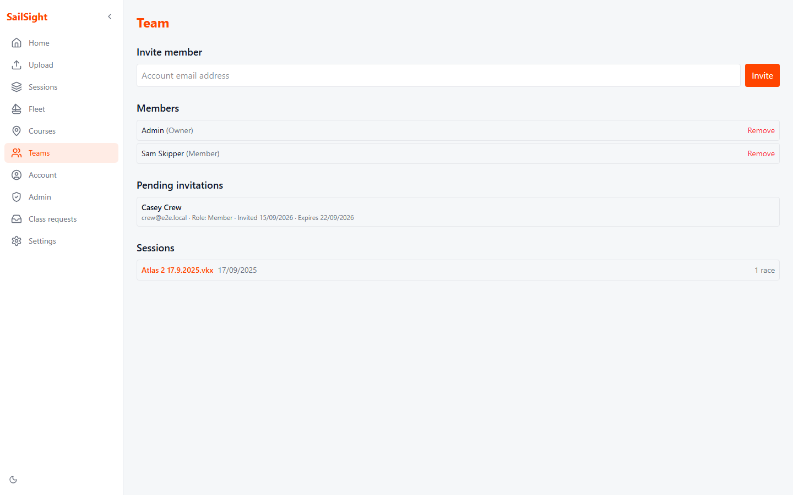
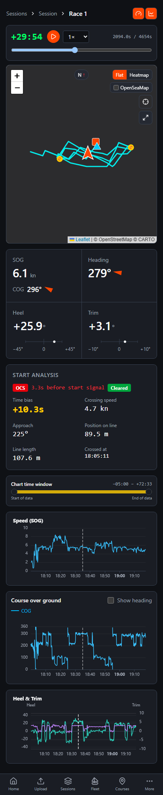
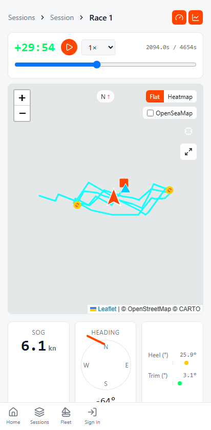
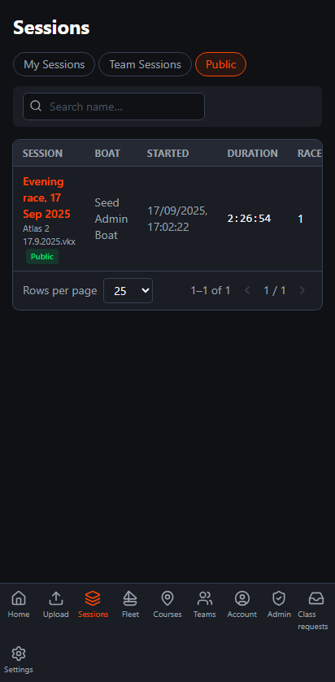

# SailSight

A self-hosted sailing telemetry analysis tool for [Vakaros](https://vakaros.com/) devices. Upload your `.vkx` log files, explore GPS tracks on an interactive map, and review race telemetry through recorded playback and historical charts — with multi-user accounts and team sharing.

> **User management is admin-managed.** There is no unrestricted public sign-up, self-service password reset, email verification, or social login. The first admin is bootstrapped from environment variables; admins can create users with one-time setup URLs or issue shareable invitation links. Links are shared out-of-band (Slack/SMS/in-person).
>
> **Local quickstart:** Create an ignored `.env` with independent `POSTGRES_PASSWORD` and `RUNTIME_DB_PASSWORD`, plus `AUTH_ADMIN_EMAIL`. Optionally set `AUTH_ADMIN_PASSWORD`; otherwise obtain the first setup URL from `docker compose logs migrate`.
>
> **Map tiles:** the CARTO basemap requires an API key in production, or tiles render with an "API key required" watermark. Set `CARTO_API_KEY` in the web service's environment (left unset locally is fine — the watermark is expected in local dev). It is a **runtime** variable, so the published images work unchanged: supply your own key and restart, with no rebuild. Every deployment needs its own key, because in the CARTO dashboard you must restrict the key's "Allowed Referer URLs" to your deployment's exact origin(s); CARTO does not support wildcard referrers, only an exact comma-separated list with trailing slash (e.g. `https://your-domain/`). The key is served to the browser by design — referer restriction is what protects it, not secrecy. For `npm run dev` outside Docker, put it in an ignored `SailSight.Web/.env.local`.
>
> Run `docker compose -f docker-compose.yml up -d --build` and open `http://localhost:8081`. This is the explicit localhost development profile. Shared browser access requires HTTPS and configured proxy trust.
>
> See the [security implementation and deployment guide](docs/security/implementation.md) for account rules, SingleUser restrictions, upload limits, key protection, migrations and verification.

---

## Table of Contents

- [SailSight](#sailsight)
  - [Table of Contents](#table-of-contents)
  - [Overview](#overview)
  - [Features](#features)
  - [Screenshots](#screenshots)
  - [Architecture](#architecture)
    - [Frontend Tech Stack](#frontend-tech-stack)
    - [API Versioning and TypeScript Codegen](#api-versioning-and-typescript-codegen)
    - [Prerequisites](#prerequisites)
    - [Running with Docker Compose](#running-with-docker-compose)
    - [Self-hosting with pre-built images](#self-hosting-with-pre-built-images)
    - [Development](#development)
  - [Usage](#usage)
    - [Uploading a Session](#uploading-a-session)
    - [Managing Boats and Courses](#managing-boats-and-courses)
    - [Viewing a Race](#viewing-a-race)
  - [Projects](#projects)
  - [Contributing](#contributing)

---

## Overview

Vakaros devices record sailing telemetry — GPS position, speed, orientation, and optional sensor readings — into compact binary `.vkx` log files. SailSight provides:

- A **REST API** that validates uploads, ingests and stores telemetry, detects races, and calculates race analysis
- A **Next.js UI** for interactive visualisation of sessions and races

VKX decoding comes from the separately maintained [Vakaros.Vkx.Parser.NET](https://github.com/SCarlsen7757/Vakaros.Vkx.Parser.NET) NuGet package. SailSight accepts VKX 1.4 exports and reads the parser's SI properties; parser fixes belong in that package's repository.

---

## Features

| Feature | Description |
| --- | --- |
| 📤 **File Upload** | Upload one VKX 1.4 file at a time, up to 200,000,000 bytes; SHA-256 duplicate detection per user |
| 🏁 **Automatic Race Detection** | Races are extracted automatically from the timer events embedded in each session |
| 🗺️ **Interactive Map** | Leaflet GPS track, speed heatmap, course marks/rounding radii, gates, and recorded start-line endpoints |
| 📈 **Telemetry Charts** | ECharts for SOG, COG with optional heading, heel/trim, and recorded wind, speed-through-water, depth, temperature, load, and shift-angle heading when available |
| 🎛️ **Playback Instruments** | Digital SOG/COG, boat heading, heel, and trim readings; independently toggle instruments and charts |
| ⏯️ **Recorded Replay** | Scrub and play recordings at 0.5×–32× with synchronized map position, instrument readings, and chart playback cursors |
| 🏁 **Course-leg Analysis** | Time-weighted speed and VMG toward race-assigned marks or gate midpoints, passing-side checks, and explicit uncertain/unreached outcomes |
| 📍 **Course-aware Replay** | Select a leg to seek its approach; follow target highlighting and VMG-to-target readout/chart during playback |
| ⛵ **Boats** | Register boats with name, sail number, and class; link them to sessions |
| 📍 **Marks & Courses** | Define owned marks, rounding/gate legs, and assign courses to individual races |
| 🐳 **Self-hosted** | Docker Compose starts the database, runs migrations, then starts the API and Web UI |

See [recorded race analysis](docs/analysis/recorded-races.md) for calculation semantics and limitations. Planned capabilities are tracked in [GitHub feature issues](https://github.com/SCarlsen7757/sail-sight/issues?q=is%3Aissue%20is%3Aopen%20label%3Afeature).

---

## Screenshots

| Dark | Light |
| --- | --- |
|  |  |
|  |  |
|  |  |

<p>
  
  
  
</p>

More pages, themes and viewports are in [`docs/screenshots/`](docs/screenshots/). They are generated from seeded data with `npm run screenshots`; see [its README](docs/screenshots/README.md).

---

## Architecture

```
┌──────────────────────────┐      HTTP/JSON      ┌────────────────────────────┐
│  SailSight.Web           │ ──────────────────► │  SailSight.Api             │
│  Next.js 16 / React 19   │                     │  ASP.NET Core (.NET 10)    │
└──────────────────────────┘                     └─────────────┬──────────────┘
                                                               │ EF Core
                                                               ▼
                                                 ┌────────────────────────────┐
                                                 │  TimescaleDB (PostgreSQL)  │
                                                 └────────────────────────────┘
                                                               ▲
                                                               │
┌──────────────────────────┐      parse          ┌─────────────┴──────────────┐
│  Vakaros.Vkx.Parser.NET  │ ◄────────────────── │  VkxIngestionService       │
│  VKX decoder (NuGet)     │                     │  (inside the API)          │
└──────────────────────────┘                     └────────────────────────────┘

┌──────────────────────────┐
│  SailSight.Shared        │  ← DTOs shared between API and Web
└──────────────────────────┘
```

### Frontend Tech Stack

| Layer | Library / Tool |
| --- | --- |
| Framework | [Next.js](https://nextjs.org/) (App Router) |
| UI library | [React](https://react.dev/) + [TypeScript 5](https://www.typescriptlang.org/) |
| Styling | [Tailwind CSS](https://tailwindcss.com/) |
| Components | [Radix UI](https://www.radix-ui.com/) primitives, [Lucide React](https://lucide.dev/) icons |
| Maps | [Leaflet](https://leafletjs.com/) + [React Leaflet](https://react-leaflet.js.org/) |
| Charts | [Apache ECharts](https://echarts.apache.org/) via [echarts-for-react](https://github.com/hustcc/echarts-for-react) |
| State management | [Zustand](https://zustand-demo.pmnd.rs/) |
| API client | [openapi-fetch](https://openapi-ts.dev/openapi-fetch/) with generated types from [openapi-typescript](https://openapi-ts.dev/) |
| Theming | [next-themes](https://github.com/pacocoursey/next-themes) |

### API Versioning and TypeScript Codegen

The REST API uses URL-segment versioning (`/api/v1/...`). Each version has a dedicated [OpenAPI](https://www.openapis.org/) document that is generated at **build time** and committed to the repository at `SailSight.Api/OpenApi/SailSight.Api.json`.

The build pipeline auto-generates the frontend TypeScript types from this spec:

```
dotnet build SailSight.slnx
  └─► GenerateOpenApiDocuments       → SailSight.Api/OpenApi/SailSight.Api.json
  └─► GenerateTypeScriptTypesV1      → SailSight.Web/src/lib/api-types.ts
        (runs: npm run gen:api)
```

The generated `api-types.ts` is consumed by [openapi-fetch](https://openapi-ts.dev/openapi-fetch/) in the web app, giving fully typed API calls with no manual maintenance.

### Prerequisites

- Docker with Compose and Linux-container support (for example Docker Desktop).
- For host builds: a .NET 10 SDK and Node.js/npm. Run `npm ci` in `SailSight.Web` before `dotnet build SailSight.slnx`, which also invokes frontend type generation. Name the solution explicitly because the root also contains the Compose project. The Dockerfiles pin the container toolchains.
- Visual Studio with support for the project's .NET SDK and Docker Compose is optional; command-line development is also supported.

### Running with Docker Compose

Set the required credentials described above, then run:

```bash
docker compose -f docker-compose.yml up -d --build
```

The web UI binds to `127.0.0.1:8081`, the API to `127.0.0.1:8080`, and the database stays on the internal network. Add the development override when using the hot-reload workflow.

### Self-hosting with pre-built images

Use `docker-compose.ghcr.yml` together with this checkout's `deployment/` directory. Set digest-qualified `SAILSIGHT_API_IMAGE` and `SAILSIGHT_WEB_IMAGE`, separate migration/runtime database passwords, an initial administrator email, an HTTPS application origin, and the authentication-key certificate settings. Optionally set `CARTO_API_KEY` to your own basemap key, restricted to your origin as described above; without it maps render with a watermark. The [deployment guide](docs/security/implementation.md#sharedprivate-network-setup) explains proxy trust, storage ownership and configuration.

The database bind mount defaults to `./data/db` and covers `/home/postgres/pgdata`. Prepare an empty directory owned by the pinned image's `postgres` user for a fresh installation. Use PostgreSQL backup tools rather than copying a running database directory. Cloudflare Tunnel deployment is tracked separately in [issue #6](https://github.com/SCarlsen7757/sail-sight/issues/6).

### Development

With the same `.env` as the quickstart, `docker compose up -d --build` also loads `docker-compose.override.yml`. This adds frontend source mounts/hot reload and loopback database/debugger ports. The base-only quickstart deliberately omits this override.

**Visual Studio workflow**

1. Open `SailSight.slnx` in a compatible Visual Studio installation with Container Tools.
2. Set **docker-compose** as the startup project.
3. Press **F5** to launch the configured services and web app. The migration service must finish before the API starts.

| Service | URL / Port | Notes |
| --------- | ----------- | ------- |
| Web UI | `http://localhost:8081` | Opens automatically on F5 |
| API | `http://localhost:8080` | |
| API docs (Scalar) | `http://localhost:8080/scalar` | |
| PostgreSQL | `localhost:5432` | Exposed for DB tools (pgAdmin, DataGrip) |

**Hot-reload behaviour**

| Layer | Behaviour |
| ------- | ----------- |
| **C# API** | Visual Studio Container Tools provides the debug/Hot Reload workflow. Edits unsupported by Hot Reload require rebuilding/restarting the API. Plain Compose does not configure `dotnet watch`. |
| **Next.js web** | True file-watch hot-reload — save any `.tsx` / `.ts` file and the browser refreshes instantly. No rebuild needed. |

**When to rebuild Docker images**

```bash
# Rebuild only the web image (e.g. after adding npm packages)
docker compose build web

# Full rebuild of all images
docker compose build
```

The development override keeps `/app/node_modules` in a named volume. Rebuilding the image does not replace an existing volume's contents: after dependency changes, run `docker compose exec web npm ci` in the running development stack and restart the web service (`docker compose restart web`).

**Database migrations**

Compose runs migrations and initial administrator bootstrap in the one-shot `migrate` service; the API uses a separate runtime database role and has `Database__AutoMigrate=false`. For host development, the `Localhost` launch profile permits automatic migrations unless disabled. `SKIP_DB_MIGRATION=true` suppresses database initialization during OpenAPI generation. See the [deployment guide](docs/security/implementation.md#local-setup) for credentials and initialization.

Until `v1.0.0` the schema is a single baseline `InitialCreate` migration rather than a chain, so pre-release versions have no upgrade path and are installed fresh. After changing the model, delete the files in `SailSight.Api/Migrations/`, regenerate the baseline, and recreate your databases:

```bash
SKIP_DB_MIGRATION=true Web__PublicBaseUrl=https://localhost dotnet ef migrations add InitialCreate --project SailSight.Api --startup-project SailSight.Api

docker compose down -v   # discard the old development database
```

The two environment variables mirror what the OpenAPI build target sets; without them the design-time host fails its application-origin check.

---

## Usage

### Uploading a Session

1. Sign in and open **Upload**.
2. Drop one `.vkx` file onto the upload area, or select it using the file picker. Only VKX 1.4 exports up to 200,000,000 bytes are accepted.
3. On success, the session detail page opens with the detected races. Uploading the same file again as the same user returns a duplicate error.

The underlying endpoint is `POST /api/v1/sessions` with multipart field `file`, returning `201 Created` and a `SessionDetailDto`. In MultiUser mode it requires an authenticated cookie session and a matching `X-CSRF-Token` header from the `sailsight.csrf` cookie. Mutating requests also require `Origin` matching the configured application origin. The browser UI handles these requirements; PAT/bearer authentication is not available.

### Managing Boats and Courses

Boats, marks, and courses can be managed via the REST API:

| Resource | Endpoint |
| --- | --- |
| Boat Classes | `GET/POST /api/v1/boat-classes`, `PUT/DELETE /api/v1/boat-classes/{id}` (writes require admin) |
| Boats | `GET/POST /api/v1/Boats`, `PUT/DELETE /api/v1/Boats/{id}` |
| Marks | `GET/POST /api/v1/Marks`, `PUT/DELETE /api/v1/Marks/{id}` |
| Courses | `GET/POST /api/v1/Courses`, `PUT/DELETE /api/v1/Courses/{id}` |
| Sessions | `GET /api/v1/sessions`, `PATCH/DELETE /api/v1/sessions/{id}` |
| Races | `PATCH /api/v1/races/{raceId}` (assign a course) |

Owners manage their boats, marks, courses, and sessions. Assigning a session course does not assign it to the session's races; set each race's course explicitly. For complete contracts, see the [generated OpenAPI document](SailSight.Api/OpenApi/SailSight.Api.json).

### Viewing a Race

1. Navigate to **Sessions** in the web UI.
2. Click a session to see its detail and list of detected races.
3. Click a race to open the **Race Viewer**:
   - Toggle gauges and charts independently and use the playback slider to inspect the recording.
   - Assign a course to each race in **Edit session** to see course targets and leg analysis.
   - Select a leg to seek its approach and inspect VMG to the active target.

The separate **View session data** page currently loads only the first race's telemetry and uses the session's time bounds. It does not yet provide continuous telemetry for the entire session; sessions without races show no track there.

---

## Projects

| Project | Type | Purpose |
| --- | --- | --- |
| `SailSight.Api` | ASP.NET Core Web API | Ingestion, storage, race detection, REST endpoints |
| `SailSight.Web` | Next.js 16 / React 19 / TypeScript | Interactive web UI — map, charts, gauges, playback |
| `SailSight.Shared` | Class library | DTOs shared between the API and web projects |

VKX files are decoded by the [Vakaros.Vkx.Parser.NET](https://github.com/SCarlsen7757/Vakaros.Vkx.Parser.NET) NuGet package, maintained in its own repository.

---

## Contributing

Pull requests are welcome. For significant changes please open an issue first to discuss what you would like to change.

Developer conventions and test commands are in [AGENTS.md](AGENTS.md). The [frontend reference](SailSight.Web/doc/DesignSpecification.md) describes the current UI; the [color reference](SailSight.Web/doc/ColourScheme.md) documents its theme tokens.

1. Fork the repository
2. Create a feature branch (`git checkout -b feature/my-feature`)
3. Commit your changes (`git commit -m 'Add my feature'`)
4. Push to the branch (`git push origin feature/my-feature`)
5. Open a Pull Request
